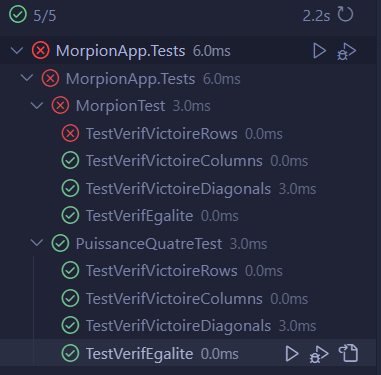

# I. Les difficultés liées à la validation

## Éléments du logiciel posant des problèmes pour la validation dans son état actuel

Dans la plupart des méthodes de validation, les éléments du logiciel qui posent des problèmes sont les suivants :
- Des boucles imbriquées et des conditions complexes.
- De nombreuses conditions et des commutateurs (switch) qui contiennent souvent plusieurs boucles dans chaque cas du commutateur, ce qui rend le code difficile à lire et à comprendre. Il y a beaucoup de cas différents à gérer et donc à tester.
- La taille de plusieurs méthodes est très longue, ce qui rend difficile la vérification complète et la couverture de tous les cas possibles.

## Problèmes liés aux choix de conception effectués par le prestataire, avec des exemples issus du code

- Les méthodes sont très longues et contiennent beaucoup de conditions et de boucles imbriquées.
- Il existe des méthodes très similaires qui se répètent dans les classes Morpion et PuissanceQuatre. Le manque de généralisation est évident. Par exemple, dans la classe PuissanceQuatre, les méthodes `tourJoueur` et `tourJoueur2` sont identiques, à l'exception d'une logique qui change. Cela entraîne une duplication de code inutile. Une meilleure approche serait de créer une classe de base commune pour gérer la logique du jeu et éviter la duplication de code.

# II. Méthodes pour résoudre ces problèmes

## Actions à mettre en place pour valider l'existant et corriger les bugs éventuels

- Refactoring : éliminer tout le code redondant en utilisant des méthodes distinctes et génériques pour améliorer la lisibilité et la maintenabilité du code.
- Tests unitaires : écrire des tests unitaires pour chaque méthode et classe afin de valider leur bon fonctionnement. Cependant, il est extrêmement compliqué de tester les méthodes qui sont très longues et contiennent de nombreuses conditions et boucles imbriquées. Donc seulement les méthodes les plus simples pourront être testées qui sont `verifVictoire` et `verifEgalite` par exemple.

## Tests unitaires pour les méthodes `verifVictoire` et `verifEgalite`
> On peut voir en testant que dans la vérification de victoire du Morpion, qu'il y a une erreur. Il manque une condition pour véirifer si la 1er ligne de la grille est gagnante.

# III. Le développement des fonctionnalités manquantes

## Procédure pour intégrer un joueur contrôlé par l’ordinateur et un système d’historisation et de persistance
Pour implémenter ces nouvelles fonctionnalités, voici les étapes à suivre :
1. Refactorisation du code : Tout d’abord, il est essentiel de rendre le code plus modulaire et générique. Cela facilitera l’intégration des nouvelles fonctionnalités. Il faudra mettre en plage un faible couplage entre les classes en optant par du polymorphisme et non pas de l'héritage. 
2. Création d’une classe pour le joueur contrôlé par l’ordinateur : Une nouvelle classe doit être créée pour gérer la logique du jeu pour le joueur contrôlé par l’ordinateur. Cette classe devra interagir avec les autres éléments du jeu (plateau, règles, etc.). Il faut mettre en place du polymorphisme pour pouvoir changer de joueur humain à joueur contrôlé par l’ordinateur en switchant entre joueur 1 et joueur 2, dans le code on devra juste appeler une méthode pour que le joueur (qu'il soit humain ou ordinateur) jour son tour, tout ça grâce au polymorphisme.
3. Système d’historisation et de persistance : Une autre classe doit être développée pour gérer l’historisation et la persistance des données du jeu. Cette classe devra enregistrer les parties jouées, les scores, les mouvements, etc. dans un fichier tel que `json`.

> Il est primordial de respecter les exigences de qualité robuste énoncées par les parties prenantes. N’oubliez pas que cette nouvelle fonctionnalité devra être testée rigoureusement.